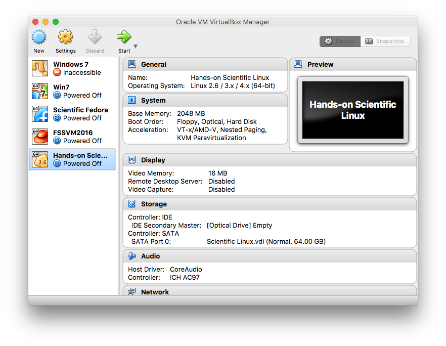
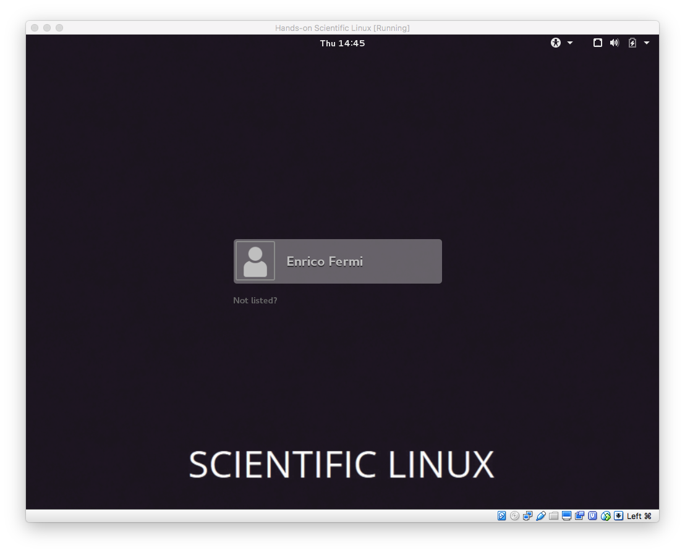

Analysis of Fermi LAT data: Hands on session
==============================================

- [Tutorials](#tutorials)
- [Pre-requisites](#pre-requisites)
- [Download VM](#download-links) and [instructions for installing](#instructions-for-installing-vm)
- [Contact](#contact)

These are the tutorials for the hands on, practical session on the analysis of *Fermi* Large Area Telescope (aka LAT) gamma-ray observations for the [São Paulo School of Advanced Science on High Energy and Plasma Astrophysics in the CTA Era](http://www.astro.iag.usp.br/~highenastro/). The goal of this activity is to get you started on the analysis of Fermi LAT data while giving you a concrete overview of the steps involved. 

This activity has a total duration of 4 hours distributed in two days. Given the somewhat short duration of these sessions, we will not have time to get into the details of all the fascinating science behind the analysis. The emphasis is on “getting your hands dirty” with the data. 

# Pre-requisites

To participate in the tutorial we recommend that you bring your laptop. Your laptop should have at least 4GB of RAM in order to comfortably run the VM. You will need about 26 GB of free space in your computer: 8 GB for the download and 18 GB to install and run the VM.

All the analysis software and data files required for this hands-on activity are already installed in a ready-to-use, self-contained [virtual machine (VM)](https://en.wikipedia.org/wiki/Virtual_machine). The VM runs on Windows, Linux and MacOS and is based on the *Scientific Linux distribution* (64 bit). It contains the `Fermi ScienceTools`, `Enrico` and `ds9`.

In order to run the VM, you will need to [download and install the VirtualBox binaries](https://www.virtualbox.org/wiki/Downloads) appropriate for your OS. 

## Download links

We recommend that you start downloading early our virtual machine, given the large file size. 

*Please do not download large files during the tutorial or the WIFI network will overload*. We will also distribute the software and data you need via USB sticks, if you did not download them before the school.

1. [VirtualBox download](https://www.virtualbox.org/wiki/Downloads)
2. Virtual machine with all software and data (8 GB)

After downloading the VM file, follow the instructions below.

## Instructions for installing VM

1. Install and launch [VirtualBox](https://www.virtualbox.org/wiki/Downloads).
2. Click on `File` -> `Import Appliance`.
3. Browse and select the VM file (`Hands-on Scientific Linux.ova`).
4. Click on `Continue` and on the next screen click on `Import`. This step may take a few minutes.
5. Once you do that, you should see a window that looks something like the following. Click `Start` to start up the VM. You should see a window pop up, and see Linux starting up inside that window.

6. In the end, you should have a window that looks like this. Contact the organizers for the password. You are good to go!

## Python and Linux background

This hands-on activity will make considerable use of Python and Linux. If you are not familiar with the Python programming language or Linux, we recommend that you study them *before* the hands-on session. Some suggested  preparatory material on the basics of Python as a scientific computing language or Linux: 

- [Lectures on scientific computing with Python](https://github.com/jrjohansson/scientific-python-lectures)
- [UNIX tutorial for beginners](http://www.ee.surrey.ac.uk/Teaching/Unix/)

# Tutorials

## Day one

- 4:30-5:00: [Introduction, overview of activities and tools (slides)](./day01-intro_slides.pdf)
- 5:00-5:30: [Obtaining and preparing LAT data for your favorite source](./prepare.md)
- 5:30-6:30: [Exploring LAT data: Plotting the counts map](./explore.md)

## Day two

- 4:30-5:00: [Overview of activity, basic theory of spectral modeling (slides)](./day02-intro_slides.pdf)
- 5:00-5:30: [Spectral modeling of a blazar: Likelihood analysis](./likelihood.md)
- 5:30-6:30: [Creating a spectrum (SED)](./sed.md)
- Bonus: [Producing a light-curve](./lc.md)

# Acknowledgements

- Luis Ricardo Manrique, Marco Antonio dos Santos: for general IT help, installing the VM on all flash drives and lab desktop machines, testing the VM
- Fabio Cafardo, Raniere Menezes: for general brainstorming and helping with preparation of the tutorials
- LAT Collaboration, particularly Jeremy Perkins: for inspiration on the activities (very helpful [analysis threads](https://fermi.gsfc.nasa.gov/ssc/data/analysis/scitools/)) and the idea of the VM
- Christoph Deil and Victor Zabalza for [their nice tutorial](http://fermi-hero.readthedocs.io/en/latest/index.html#) which inspired parts of this one

# TODO (future)

- [ ] GRB tutorial
- [ ] reproducing the tentative dark matter line from the Galactic Center
- [ ] upload data files required for activity on figshare

# Contact 

[`rodrigo.nemmen -> iag usp br`](http://rodrigonemmen.com/contact)

[Author's web page](https://rodrigonemmen.com/)

Twitter: [@nemmen](https://twitter.com/nemmen)