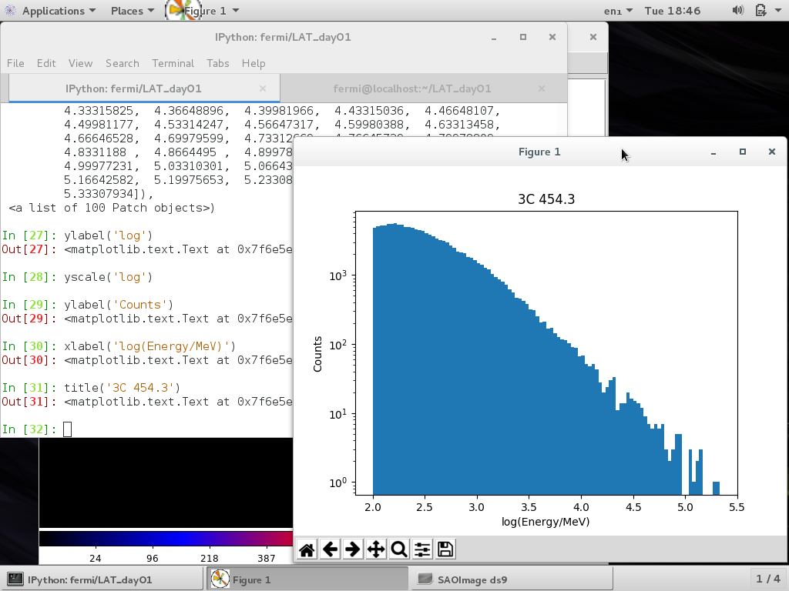
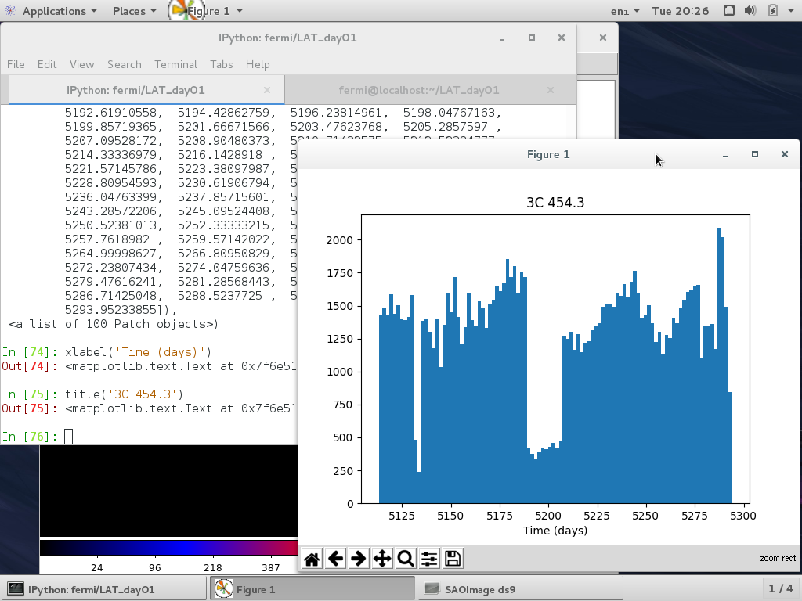

Exercise solutions: Exploring The Data
========================================


# Exercise 1

[comment]: <> (http://fermi-hero.readthedocs.io/en/latest/getting_started/explore_events.html) 

IPython solution:

```python
hdulist = pyfits.open('[SOURCE]_filtered_gti.fits')
events=hdulist[1].data

hist(log10(events['ENERGY']),100)
yscale('log')
xlabel('log10(Energy/MeV)')
```



Note that we plot the histogram with both axes in log-scale in this example.

# Exercise 2

```python
hist(log10(events['TIME']),100)
xlabel('Time (s)')
```



