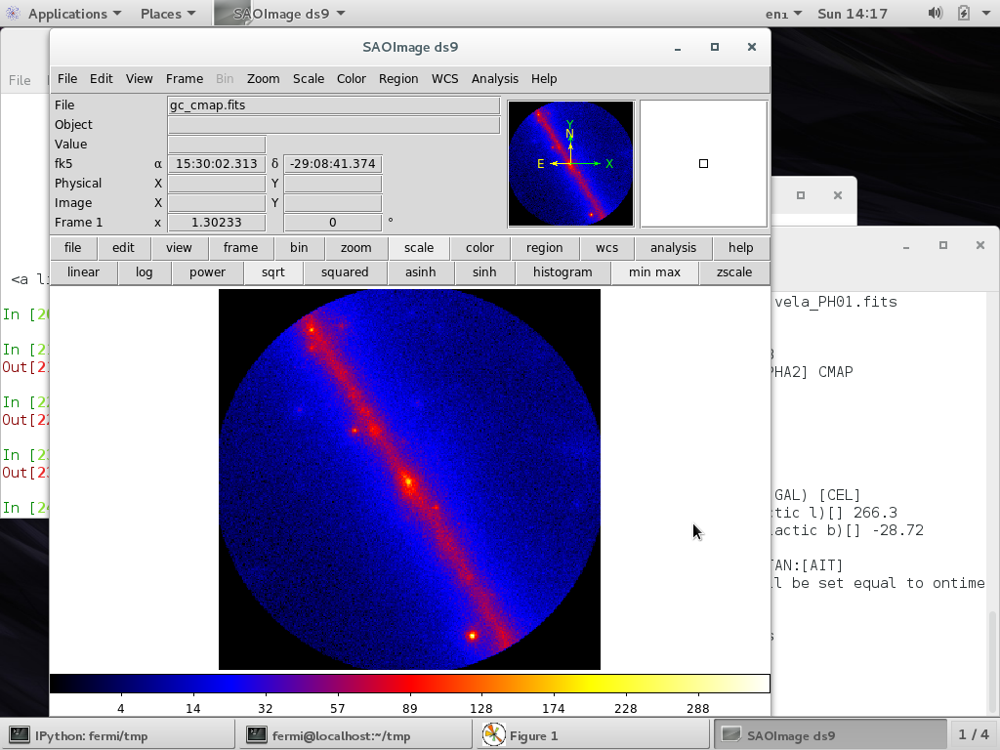

Exploring The Data
=====================

Now that we have prepared an event list that only contains astrophysical photons, we will do some basic inspection of the data—what can we learn before doing any kind of statistical modeling?

We will have a look at the energy and time distribution of the events (counts spectrum and count light curve, respectively) as well as their spatial distribution—i.e. creating an (*RA, DEC*) image of the detections (counts map).

# Exercise 1: Count spectrum

[comment]: <> (http://fermi-hero.readthedocs.io/en/latest/getting_started/explore_events.html) 

Plot the histogram of the distribution of energies for the events in the events file resulting from all cuts you performed in the last session.

- - - 

You should get something that looks like this:


Note that the counts spectrum for 3C 454.3 looks like a power-law. However, keep in mind that this is not the spectral energy distribution (energy flux x energy). Why? Because in order to have the SED we need the flux which is defined by

    flux = counts / exposure,

where

    exposure = (effective area) x (observation time).

In other words, we have to correct for the exposure to get the SED. We will perform this exposure-compensation tomorrow. 


# Exercise 2: Counts lightcurve 

Plot the histogram of the time distribution for the events—the counts lightcurve.

[comment]: <> (which is proportional to the event rate since we use equal-width time bins)

You should get something similar to this plot:


Notice how variable is the region we are observing.


# The spatial distribution of events: The *counts map*

Next, you will create a Counts Map of the ROI (region of interest), summed over photon energies, in order to identify candidate sources and to ensure that the field looks sensible as a simple sanity check.

For creating the Counts Map, we will use the `gtbin` tool with the option "CMAP" (no spacecraft file is necessary for this step). Then we will view the output file, as shown below:

``` 
[fermi@localhost ~]$ gtbin
>> Type of output file (CCUBE|CMAP|LC|PHA1|PHA2|HEALPIX) [PHA2] CMAP
Event data file name[] [SOURCE]_filtered_gti.fits
Output file name[] [SOURCE]_cmap.fits
Spacecraft data file name[] NONE
Size of the X axis in pixels[] 400
Size of the Y axis in pixels[] 400
Image scale (in degrees/pixel)[] 0.08
Coordinate system (CEL - celestial, GAL -galactic)[] CEL
First coordinate of image center in degrees (RA or galactic l)[] [SOURCE RA]
Second coordinate of image center in degrees (DEC or galactic b)[] [SOURCE DEC]
Rotation angle of image axis, in degrees[] 0.0
Projection method Projection method e.g. AIT|ARC|CAR|GLS|MER|NCP|SIN|STG|TAN:[] AIT
gtbin: WARNING: No spacecraft file: EXPOSURE keyword will be set equal to ontime.
```

Explanation about the image scale: Since we have a ROI of 20˚ radius (40˚ diameter) and we want a 400x400 pixels image, we must select a pixel size of 

    pixel size = (ROI diameter)/(image size) = 40/400 = 0.1.

## Plot counts map with `ds9`

You will also be using a software called `ds9`, which is a FITS File Viewer which gives you a lot of interactive control to explore the data. Starting it up is easy, just type:

    ds9 3C279_cmap.fits &

You can see several strong sources and a number of weaker sources in the map.

Let’s improve our image visualization. Do you see the gray buttons located in-between the image and the coordinates? Select the options 

- `scale -> sqrt` (show `sqrt(counts)`)
- `color -> b` (change colormap to something more pretty)
- `zoom -> fit`

You should end up with something that looks like the image below—obtained for the case of the Galactic Center:


It is important to inspect your data prior to proceeding to verify that the contents are as you expect. A malformed data query or improper data selection can generate a non-circular region, or a file with zero events. By inspecting your data, you have an opportunity to detect such issues early in the analysis.

Now you should play around a bit with `ds9` to explore its different options. 

### Optional exercise

Can you find out what is the strong point source in the lower right corner of the image?

## Plot counts map with Python

There is another way to generate the counts map using Python. This is not as interactive as using `ds9`, but provides a way of quick inspection in those cases when `ds9` is not installed.

```python
ipython --pylab

import pyfits
cmap = pyfits.open('[SOURCE]_cmap.fits')
imshow(cmap[0].data)
colorbar()
show()
```

- - - 

[Solutions to exercise](./explore-solutions.md).

