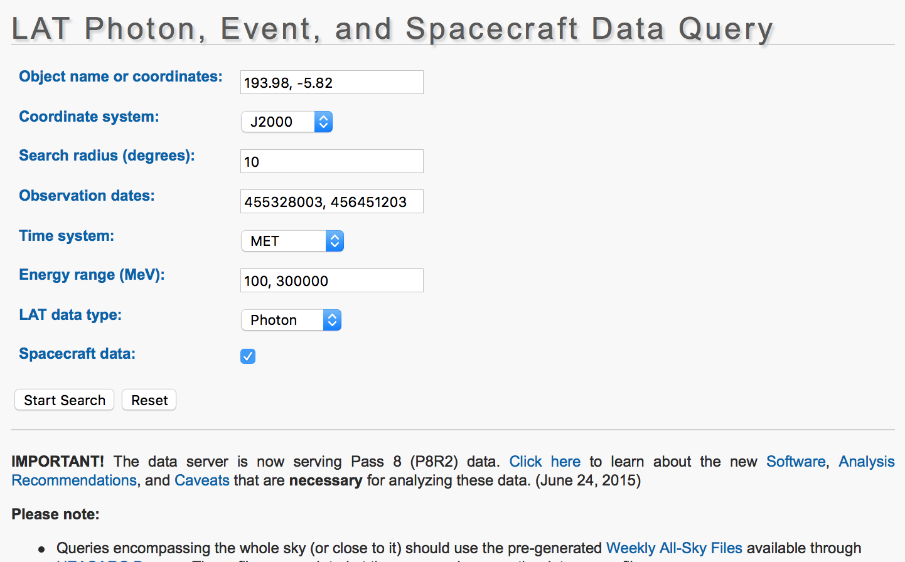

create light curve for 3C 279, reproducing the Paliya et al. result
======================================

# get data

data extracted using the following parameters:

data is already conveniently there

# Initial setup

cd ~/day02
mkdir lc
cd lc

use [`lc.conf`](./lc.conf)
note the fixed spectral index at 2.0 like Paliya
13 bins

# Generate the light curve

enrico_xml lc.conf

enrico_lc lc.conf
started 2:21
finished 5:32
dt = 3:10

`enrico_plot_lc lc.conf`

see file `3C279_LC.png`
