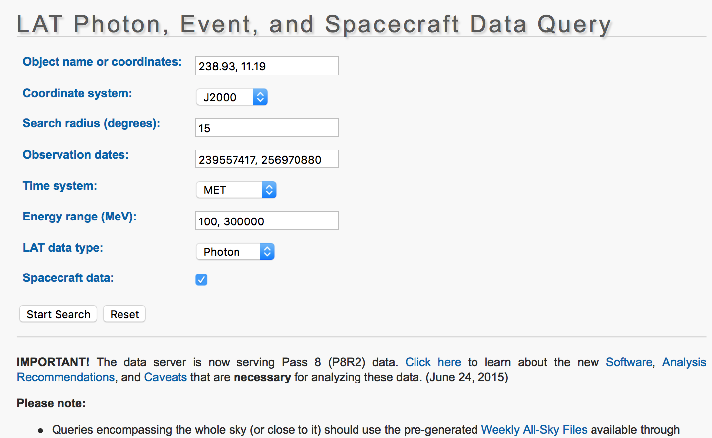

Likelihood analysis: Getting a flux
======================================

In this hands-on activity, you will learn how to produce get the parameters of a spectral model—let’s say, flux and spectral index—for the blazar PG1553+113 observed with *Fermi* LAT. You  will perform a full likelihood analysis for PG1553+113. 

The results from the analysis of this dataset were [published by the Fermi LAT Collaboration](http://adsabs.harvard.edu/abs/2010ApJ...708.1310A). So you will be able to compare the results of your analysis with those published in that paper.

# Overview

A number of [steps](https://fermi.gsfc.nasa.gov/ssc/data/analysis/documentation/Cicerone/Cicerone_Likelihood/Likelihood_overview.html) are necessary to fit a source's spectra; these are described in detail below.

1. *Select the data.* The data from a reasonably large spatial region around the source(s) being analyzed must be used because of the overlapping of the point spread functions (PSF) of nearby sources.
2. *Select the model*. This model includes the position of the source(s) being analyzed, the position of nearby sources, a model of the diffuse emission, the functional form of the source spectra, and values of the spectral parameters. In fitting the source(s) of interest, you will let the parameters for these sources vary, but because the region around these sources includes counts from nearby sources in which you are not interested, you might also let the parameters from these nearby sources vary.
3. *Precompute a number of quantities that are part of the likelihood computation*. As the parameter values are varied in searching for the best fit, the likelihood is calculated many times. While not strictly necessary, precomputing a number of computation-intensive quantities will greatly speed up the fitting process.
4. Finally, *perform the fit*. The parameter space can be quite large—the spectral parameters from a number of sources must be fit simultaneously—and therefore the likelihood tools provide a choice of three numerical “optimizers” to maximize the likelihood efficiently. Fitting requires repeatedly calculating the likelihood for different trial parameter sets until a value sufficiently near the maximum is found. The variation of the likelihood in the vicinity of the maximum can be related to the uncertainties on the parameters, and therefore these optimizers estimate the parameter uncertainties.

Thus likelihood spectral fitting provides the best fit parameter values and their uncertainties. 

[comment]: <> (But is this a good fit? When χ2 is a valid statistic, then we know that the value of χ2 is drawn from a known distribution, and we can use the probability of obtaining the observed value as a goodness-of-fit measure. When there are many degrees of freedom i.e., the number of energy channels minus the number of fitted parameters then we expect the χ2 per degree of freedom to be ~1 for a good fit. However, when χ2 is not a valid statistic, we usually do not know the distribution from which the maximum likelihood value is drawn, and therefore we do not have a goodness-of-fit measure.) 

# Using `Enrico`

We will use the `Enrico` python tools instead of using directly the ScienceTools. Enrico is very convenient because it hides away the complexity of the analysis that is going on under the hood. Enrico takes care of calling all the appropriate ScienceTools in the correct order.

First of all, let’s test Enrico’s installation. Open a terminal and type:

    enrico_setupcheck

Everything should go well because we are running the activity in the VM, where Enrico is pre-installed. Now that you’ve checked that everything is in place, let’s get the data you will analyze.

# Get the data

Let’s extract the events for a region of radius 15˚ around PG 1553 in the time range 2008-08-05 to 2009-02-21. These are the parameters that you will use for the exercise: 


Normally you would go to go to the NASA FSSC server website, input the selection criteria and download the files. However, in order to save time and bandwidth, *all the necessary files have already been downloaded and are available in the VM* in the folder `LAT_day02/data`. The data files are the following:

- `pg1553_PH0#.fits`: events files
- `pg1553_SC00.fits`: spacecraft file

# Create a configuration file

In the terminal, now type

```shell
cd ~/LAT_day02
mkdir flux
cd flux
```

You are now in the directory which will hold the results of the likelihood analysis. 

Since there is more than one events file, you will need to provide an input file list in your analysis below. This text file can be generated by typing:

```shell
ls ~/LAT_day02/data/pg1553_PH* > events.txt
```

`Enrico` uses [configuration files](http://enrico.readthedocs.io/en/latest/configfile.html) to run the analysis. You can use the `enrico_config` tool to quickly make a config file called `pg1553.conf`. It will ask you for the required options and copy the rest from a default config file located at `enrico/data/config/default.conf`:

[comment]: <> (Parameters below from http://fermi-hero.readthedocs.io/en/latest/spectrum/index.html#make-a-config-file)

- - - 
**Create configuration file**

```
[fermi@localhost flux]$ enrico_config pg1553.conf
[Message]: Please provide the following required options [default] :
Output directory [/home/fermi/day02/flux] : 
Target Name : PG1553  
Right Ascension: 238.93
Declination: 11.19
redshift, no effect if null [0] : 0.36
ebl model to used
0=Kneiske, 1=Primack05, 2=Kneiske_HighUV, 3=Stecker05, 4=Franceschini, 5=Finke, 6=Gilmore : 0
Options are : PowerLaw, PowerLaw2, LogParabola, PLExpCutoff, Generic
Generic is design to allow the user to fit with non-supported models
EBL absorption can be added for PowerLaw2, LogParabola, PLExpCutoff
Spectral Model [PowerLaw] : PowerLaw2
ROI Size [15] : 
FT2 file [/home/fermi/enrico/Data/download/lat_spacecraft_merged.fits] : /home/fermi/day02/data/pg1553_SC00.fits
FT1 list of files [/home/fermi/enrico/Data/download/events.lis] : events.txt
tag [LAT_Analysis] : spectrum
Start time [239557418] : 
End time [334165418] : 
Emin [100] : 
Emax [300000] : 
IRFs [CALDB] : 
evclass [128] : 
evtype [3] : 
Corresponding IRFs	=	('P8R2_SOURCE_V6', ['BACK', 'FRONT'])
Is this ok? [y] : 
Corresponding zmax =  90
```
- - - 
Some notes:

- Always give the full path for the files in enrico
- We are using the `PowerLaw2` model--a simple power-law spectrum with the form

`dN/dE \propto E^gamma`

where *dN/dE* is the monochromatic photon flux, *gamma* is the spectral index. 

- Time is give in MET
- Energy is given in MeV
- ROI size is given in degrees
- The redshift of this blazar is *z*=0.36. Because it is reasonably far away, gamma-rays will interact with lower energy photons in the [extragalactic background light (EBL)](https://www.universetoday.com/wp-content/uploads/hess_jet_quasar.jpg), pair-produce, and the resulting spectrum we will measure is not exactly a power-law but is attenuated at the high-energy end. We will see this clearly in the next session.

If you want, you can edit this config file by hand to make further adjustments.


# Generate a source model: XML file

The ScienceTools need a source model written in the xml format. You can run `enrico_xml` to make such model of the sky and store it into a xml file which will be used for the analysis. The options for this step are directly provided in the config file. For the `enrico_xml` tool, the relevant options are in the `[space]` and `[target]` sections. The out file is given by `[file]/xml` field.

This tool will automatically add the following sources to the xml source model file:

- Your target source
- The galactic (`GalDiffModel`) and isotropic (`IsoDiffModel`) diffuse components that are the dominant background sources in most LAT analysis.
- All the LAT sources from the 4-year catalog (3FGL) that are inside the ROI. The spectral parameters of the sources within 3 degrees of our source are left free so they can be fit simultaneously with our source, whereas those further away are fixed to their catalog values.

- - - 
**Create sources model**

```
[fermi@localhost flux]$ enrico_xml pg1553.conf 
use the default location of the catalog
use the default catalog
Use the catalog :  /home/fermi/enrico/Data/catalog/gll_psc_v16.fit
[Message]: Summary of the XML model generation
Add  41  sources in the ROI of  17.0 ( 15.0 + 2 ) degrees
4  sources have free parameters inside  3.0  degrees
0  source(s) is (are) extended
Iso model file  /home/fermi/enrico/Data/diffuse/iso_P8R2_SOURCE_V6_v06.txt
Galactic model file  /home/fermi/enrico/Data/diffuse/gll_iem_v06.fits
[Message]: write the Xml file in /home/fermi/day02/flux/PG1553_PowerLaw2_model.xml
``` 
- - - 

You can explore the `PG1553_PowerLaw2_model.xml` output file with a text editor. 


# Perform the likelihood fit

This is where the magic happens. The `enrico_sed` tool will take care of executing all the steps necessary for you to get a global likelihood fit and find the best-fit parameters by minimizing the likelihood function. `enrico_sed` will look into the options you have selected in `pg1553.conf` and call the following ScienceTool tasks:

1. `gtselect`: Perform event selection (ROI, energy cuts)
2. `gtmktime`: Perform time selection based on spacecraft file, getting GTIs
3. `gtbin`: Bin the data, computes counts map
4. `gtltcube`: Perform the calculation of the livetime cube. This is the most computationally intensive step, taking.
5. `gtexpcube2`: Use the previously generated livetime cube and apply it to your ROI to obtain an exposure cube.
6. `gtsrcmaps`: Create model counts maps for each of the sources in the source model catalog. This is used to speed up the likelihood calculation of `gtlike`.
7. `gtlike`: Maximize the likelihood function numerically and get initial estimate of parameters
8. Optimize fit: improve parameter estimate

To run the likelihood maximization just issue in the terminal:

    enrico_sed pg1553.conf

You will need to be patient because this will take quite a while. On my 2015 MacBook running the analysis in the VM, this took about 50 minutes to complete. Some possibilities of things to do while you wait:

- go get some water or coffee
- come see our computer cluster at the second floor of IAG
- discuss gamma-ray astrophysics with your colleagues

After the analysis finishes, you should get something similar to [this output from `enrico_sed`](./enrico_sed_output.txt). 

## Exercise 1

Inspect the log generated on the terminal by `enrico_sed` and identify the different tasks that are being performed. 

## Exercise 2

Open the file `PG1553_PowerLaw2_239557418_334165418_100_300000_spectrum.results`—which holds the results of the likelihood fit—in a text editor and answer the following questions:

- What is the resulting spectral index and uncertainty? 
- What is the flux? What do you think are the units?
- What is the *approximate* statistical significance of the presence of a point source in the location of this blazar, in standard deviations?

## exercise 3: plot count maps, model map and residuals

is the fit good?

residuals look good?

## exercise
how to decide which model is better?

explain meaning of spectrum


