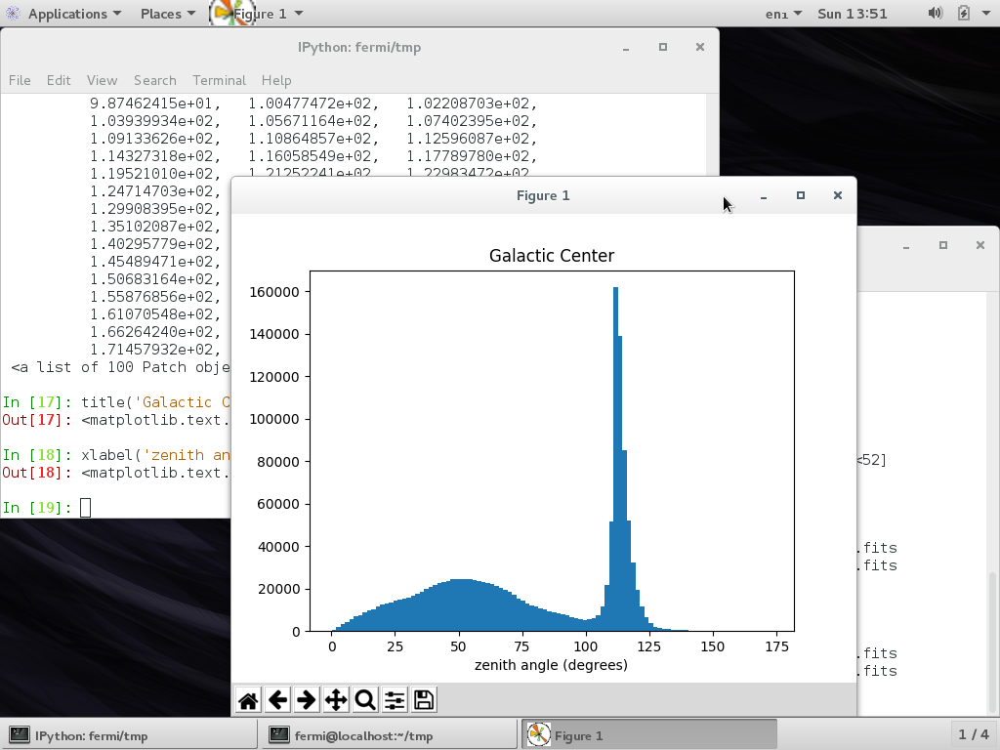

Solutions to exercises: Obtaining and preparing LAT data for your favorite source
=====================================================

## Exercise 1

This is one simple way of looping through the columns and printing them out:

```python
events=hdulist[1].data
n=events['ENERGY'].size # size of array

for i in range(n):
	print(i,events['ENERGY'][i], events['RA'][i], events['DEC'][i], events['TIME'][i])
```

## Exercise 2

```python
hist(events['ZENITH_ANGLE'],100)
xlabel('Zenith angle (degrees)')
```



## Exercise 3

Using IPython:

```python
import pyfits

# read FITS file
hducut = pyfits.open('[SOURCE]_filtered_gti.fits')
eventscut=hdunew[1].data

# plot
hist(eventscut['ZENITH_ANGLE'],100)
xlabel('Zenith angle (degrees)')
```


When comparing this histogram with the one generated in the previous exercise, notice the impact of the zenith angle cut.

## Exercise 4

Assuming you ran the previous exercises in the same IPython environment, we will reuse the previously generated variables:

```python
# we read both events files
before0 = pyfits.open('[SOURCE]_PH00.fits')
before1 = pyfits.open('[SOURCE]_PH01.fits')
# total number of events summing from both events files
nbefore=before0[1].data['ENERGY'].size+before1[1].data['ENERGY'].size
print("Number of events before the cut",nbefore)

# now we deal with the events file after the data cuts
after = pyfits.open('[SOURCE]_filtered_gti.fits')
nafter=after[1].data['ENERGY'].size
print("Number of events after the cut",nafter)
```

Note that we have way less counts now than before performing the data preparation. The reason is that  we considered only events which have good quality—i.e. high probability of being astrophysical photons (event class and event type selection). Most importantly, we also removed the Earth limb photons and considered only photons with appropriate GTI values.