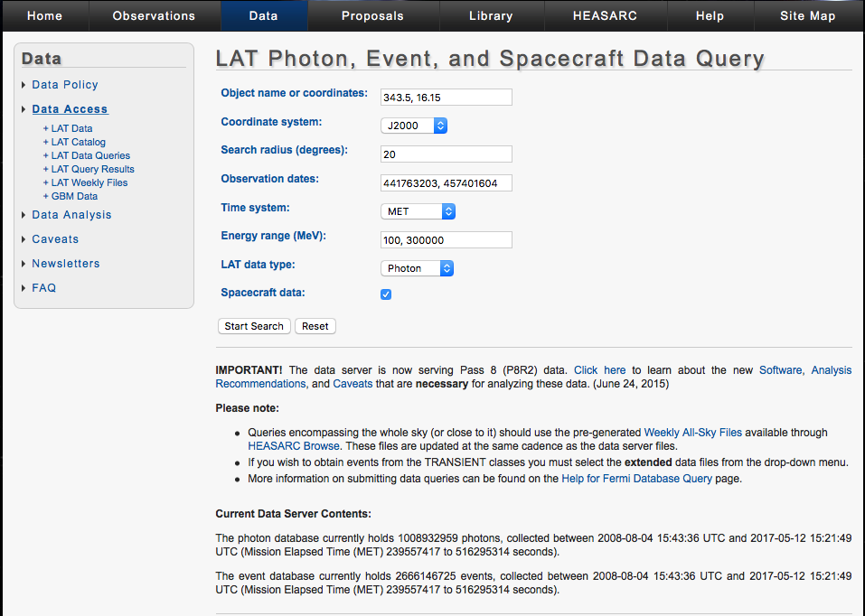
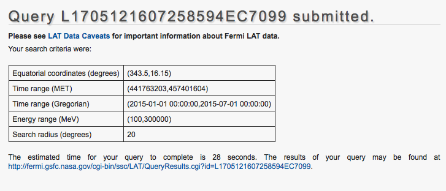
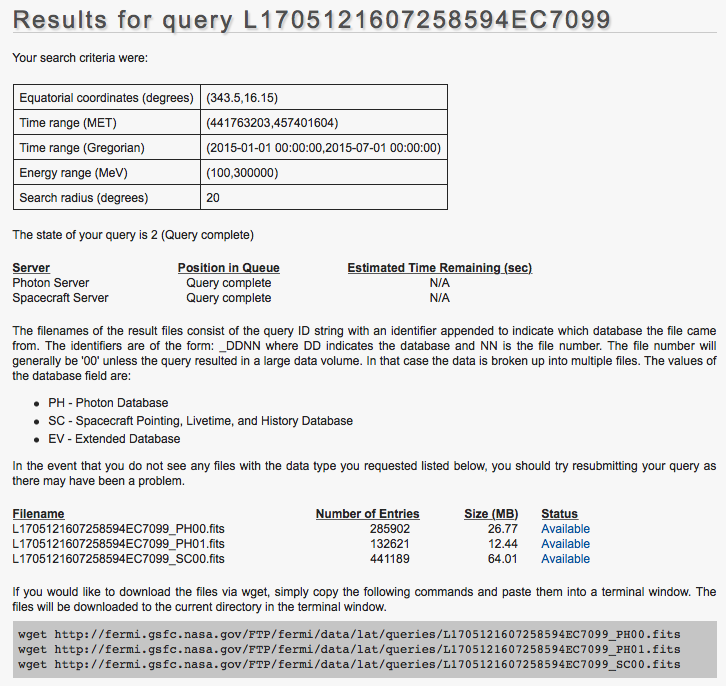
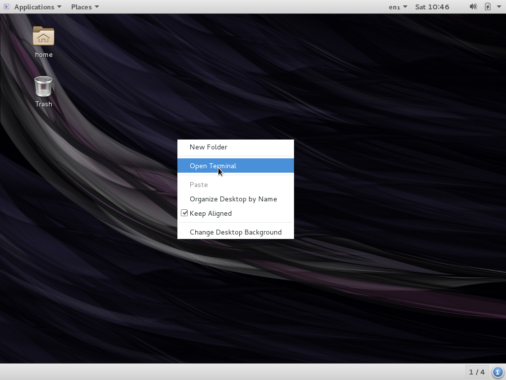
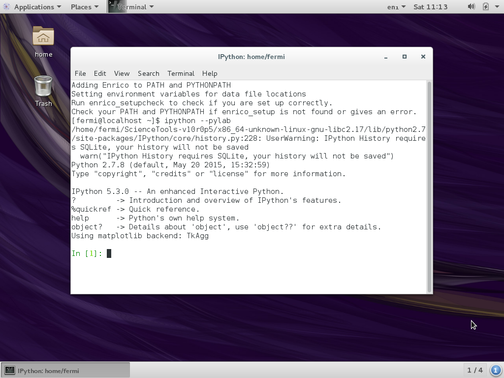
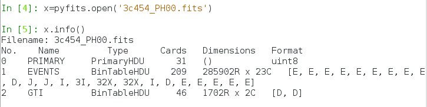

Obtaining and preparing LAT data for your favorite source
=====================================================

This hands-on lesson is structured in the following sections:

1. Software that will be used
2. Types of Fermi LAT data
3. How to obtain (download) the data
4. First inspection of LAT photon files
4. How to prepare the data

# Software

The following software will be needed for this hands-on activity:

- `Fermi ScienceTools`
- `ds9`
- `topcat`
- `Enrico`

**Important:** All the analysis software and data files required for this hands-on activity are already installed in a ready-to-use, self-contained [virtual machine (VM)](https://en.wikipedia.org/wiki/Virtual_machine). The VM runs on Windows, Linux and MacOS. *Please do not download large files during the tutorial or the WIFI network will overload*. We will also distribute the software and data you need via USB sticks, if you did not download them before the school.

We describe below the purpose of each tool.

## `Fermi ScienceTools`

The main analysis software you will use for this hands-on activity is the Fermi data analysis software called the [`Fermi ScienceTools`](https://fermi.gsfc.nasa.gov/ssc/data/analysis/software/).

The ScienceTools consists of several tools that can be called using the command-line to perform different tasks in the analysis. 

The [Fermi Science Support Center web pages](https://fermi.gsfc.nasa.gov/ssc/) contain a lot of information about Fermi data access and data analysis. If you have a problem you or Google can’t solve, you can contact the official [NASA Fermi help desk](https://fermi.gsfc.nasa.gov/ssc/help/).

## `ds9`

[SAOImage DS9](http://ds9.si.edu/site/Home.html) is one of the best viewers for astronomical 2D images and 3D cubes.

## `TOPCAT`

[TOPCAT](http://www.star.bris.ac.uk/~mbt/topcat/)—also known as “Tool for OPerations on Catalogues And Tables”—is a useful GUI for interacting and exploring astronomical catalogues and tables. 

## `Enrico`

[Enrico](http://enrico.readthedocs.io/en/latest/index.html
) is a set of high-level Python scripts that help immensely with performing common Fermi LAT data analysis tasks. For example:

- Data and model preparation with the `gt-tools`
- Extracting a spectral energy distribution (SED) of a source
- Generating TS and residual maps for a region of interest
- among many other uses

`Enrico` takes a single config file as input where you specify what kind of analysis you want to run and the most important analysis parameters, and then run all Fermi science tools in the right order (or in parallel where possible) with the right parameters for you.

An alternative set of Python wrappers is [FermiPy](http://fermipy.readthedocs.io/en/latest/) which provides similar functionality and convenience as `Enrico`. 

## If you are installing the software on your own Linux or MacOS system

Here are some directions for those that would like to install the software directly in their OS instead of using the pre-packaged VM. 

In order to get the ScienceTools and Enrico working together, you need to setup some environment variables after installing the software. If you are curious, please have a look at the `.bashrc` init file located in your home directory in the VM.

Also, note that the ScienceTools have their own Python distribution which conflicts with any pre-existing Python installed on your system, hence the need for setting up the environment variables properly. Keep that in mind.


# Types of *Fermi* LAT Data files

Here we will learn how to extract LAT data files from the *FERMI Science Support Center* (FSSC) databases. In order to analyze LAT data, you will need:

1. An **events file** containing the recorded events--which include detected photons and cosmic rays--that correspond to your source of interest, as well as the area surrounding that source. The size of this surrounding "region-of-interest", or ROI, that you choose will depend on the density and brightness of nearby sources, as well as the type of analysis you are performing. 

The most important parameters in the events file are:

- (RA, DEC) (degrees). Equatorial coordinates called right ascension RA and declination DEC.
- (L, B) (degrees). Galactic coordinates called Galactic longitude L and latitude B.
- ENERGY (MeV)
- TIME (seconds). Mission elapsed time when the event was detected. (MET is the total number of seconds since 00:00:00 on January 1, 2001 UTC)

2. A **spacecraft file** containing spacecraft position and orientation information at 30 second intervals. This file is required for LAT science analysis. You can use the same spacecraft file (~700 MB for 5 years) for all your analyses as long as it covers the time range you want to analyze. That’s all you need to know about the spacecraft data file. The LAT data server will only generate a single spacecraft file, regardless of the size of the dataset.
3. Most analyses also require **models of the isotropic and Galactic diffuse background**. 

All these files are pre-installed in the VM.

If you want more information about the files you just downloaded, you can check out [this website](https://fermi.gsfc.nasa.gov/ssc/data/analysis/documentation/Cicerone/Cicerone_Data/LAT_Data_Columns.html). In this tutorial we will have a quick look at the Fermi LAT dataset by binning the events into histograms:

- A 2-dimensional (L, B) histogram is called a counts image.
- A 1-dimensional ENERGY histogram is called a counts spectrum.
- A 1-dimensional TIME histogram is called a counts lightcurve.

In the Day 2 hand-on session, we will show you how to create a *flux spectrum (SED)*, *flux lightcurve* and *flux image*, where `flux = counts / exposure` and `exposure = (effective area) x (observation time)` and in addition the exposure, the spatial resolution--called point spread function (PSF)--and energy resolution have all been taken into account.


# Obtain LAT data 

First, you need to decide what kind of source you want to analyze, i.e. which part of the sky are your LAT photons coming from? In this tutorial, we will give three options of sources. Pick the one you prefer:

- A **supermassive black hole powering a relativistic jet**: cool! In this case, we suggest the brightest blazar seen so far by LAT--the FSRQ blazar 3C 454.3 (catalog name `3FGL J2254.0+1608`) located at coordinates RA = 343.5˚ and Dec = 16.15˚
- A **pulsar**: you are a stellar person, huh? We suggest the brightest pulsar seen by LAT--the Vela pulsar--located at coordinates RA = 128.84˚, Dec = -45.18˚
- Our **Galactic Center** (GC): this region of the sky points in the direction of our nearest supermassive black hole--Sagittarius A*--and also the highest density of dark matter in the Milky Way. It is located at coordinates RA = 266.3˚ and Dec = -28.72˚

Once you select your favorite source for inspection which will define the sky coordinates of interest, the next step is to decide (i) the extension of the region around the source for which you want to extract photons (the region of interest, ROI), (ii) the range of observations dates and (iii) the photon energy range. We suggest the following choices:

- Search radius for region of interest around source: 20˚
- Date range (MET): 441763203, 457401604. LAT uses a very special time unit called the [Mission Elapsed Time (MET)](https://fermi.gsfc.nasa.gov/ssc/data/analysis/documentation/Cicerone/Cicerone_Data/Time_in_ScienceTools.html) which is the number of seconds since midnight at the beginning of January 1, 2001, in the UTC system. The range given here corresponds to the first semester of 2015.
- Energy range (MeV): 100, 300000. This is the normal energy range used in LAT analysis.

Once you made your choices for selecting the photons, normally you would go to go to the NASA FSSC server website, input the selection criteria and download the files. However, in order to save time and bandwidth, all the necessary files have already been downloaded and are available in the folder `sources`. *You do not need to download the data for this activity.*

We describe below the step-by-step instructions for downloading the data files from the server. You do not need to do this for the activity.


## Instructions for downloading the data (only for reference, not needed for hands-on)

Now we will learn how to extract and download the LAT data from the FSSC server. To select all photons within a circular region around the source:

1. Go to the [FSSC's web site data server](https://fermi.gsfc.nasa.gov/cgi-bin/ssc/LAT/LATDataQuery.cgi)
2. Input the following set of parameters:

* Object name or coordinates: *[choose the coordinates depending on your favorite source: pulsar, blazar or GC]*
* Coordinate system: "J2000"
* Search radius (degrees): 20
* Observation dates: 441763203, 457401604 *[if you enter `START` in the first field, it will extract photons since the beginning of the mission]*
* Time system: "MET"
* Energy range (MeV): 100, 300000
* LAT data type: "Photon"
* Spacecraft data: "checked"



3. Click on the 'Start Search' button. The 'Query Submitted' webpage will be displayed and provide an estimate of the time to complete the query, as well as a link to the results webpage.



We suggest that you capture the information reported on the query page in a text file accompanying your data. While it can be retrieved through other means, having the information from your query easily accessible may ease certain portions of the analysis.

When you go to this new webpage--'LAT Data Query Results'--you may be told that the query is not yet complete. This webpage will show you a link to where the results of your query can be found. When the query is complete, the data file list will include links to the files themselves.



4. Download the spacecraft (pointing and livetime history) file and events data file to your working directory. The results page include convenient `wget` commands that you can copy and paste in the terminal window to download all the FITS files. 

Once the download is finished, there may be multiple events files (`*_PH##.fits`), but there should be only a single spacecraft (`*_SC##.fits`) file. We are done with retrieving the data files!


# A first inspection of Fermi LAT photon files

[comment]: <> (goal: inspect files, get an idea of their structure, learn how to use pyfits for this purpose; inspiration: http://fermi-hero.readthedocs.io/en/latest/getting_started/first_look.html)

Event files like are FITS files. For historical reasons, [FITS](https://en.wikipedia.org/wiki/FITS) is the standard data format in astronomy for arrays (e.g. 2D images) and tables (e.g. source catalogs or event lists). A FITS file consists of header-data units (HDUs), where each HDU is an array or table. For historic reasons the first HDU (a.k.a. primary HDU) has to be an array, so in FITS files that only contain tabular data the primary HDU will be a dummy, empty HDU.

Let’s use a few different tools to explore the content of the events file for your selected source. We will first use `IPython` and the module `pyfits` to list the content of FITS files. [IPython](https://ipython.org) is a very popular environment for interactive scientific analysis. 

First open a terminal:


Issue the command

    ipython --pylab

to open the IPython environment. The `--pylab` argument makes sure that convenient plotting modules are loaded on startup. You should see this:


Let’s load the `pyfits` module to be able to handle FITS files: enter the command `import pyfits` in IPython. Now let’s get a summary of the FITS file structure:

    hdulist = pyfits.open('[SOURCE]_PH00.fits')
    hdulist.info()

where you replace the filename with the one corresponding to your favorite source. Replace `[SOURCE]` above with either `vela`, `3c454` or `gc`. You should get something looking like the following output:


So this event file contains an `EVENTS` table with 285902 events and a `GTI` (good time interval) table with 1702 GTIs. GTIs are needed to compute exposure. Exposure is needed to compute the flux of sources.

To list the names and units of the columns in the EVENTS and GTI table use 

```python
hdulist[1].columns # shows info for EVENTS table
hdulist[2].columns # shows info for GTI table
``` 

If you want to see only the names of the columns in the EVENTS table, you can use:

    hdulist[1].columns.names

Now, let’s have a look at the actual data stored in some of the columns of the EVENTS table. If you want to retrieve the energies of all events detected by LAT for your source:

```python
events=hdulist[1].data
events['ENERGY']
```

Using this notation, you can easily inspect all the data for your source, making use of the power of `numpy` arrays.

## Exercise 1

Write code that prints out the energies, RA, DEC and time stamps of all events detected by LAT for your source in the following format: 

```
            ENERGY             RA            DEC                    TIME
               MeV            deg            deg                       s
  1        398.907        94.0848        5.88669        378713295.231454
  2        425.700        91.8646        7.99151        378724463.542101
  3        262.569        93.0315        4.90930        378724578.466829
…
```  

Try to solve the problem on your own. Only by working on it you will really learn. See [`prepare-solutions`](./prepare-solutions.md#1) for one possible solution.


This is one simple way of looping through them:


close the file

data summaries
http://fermi-hero.readthedocs.io/en/latest/getting_started/python.html


# Data Preparation

Goal of data preparation.
Why is it needed?
http://fermi-hero.readthedocs.io/en/latest/getting_started/prepare_data.html

compare data with and without zenith cut, removing Earth gamma-rays


Data preparation consists of two steps:

* (*gtselect*): Used to make cuts based on columns in the event data file such as time, energy, position, zenith angle, instrument coordinates, event class, and event type.

* (*gtmktime*): In addition to cutting the selected events, *gtmktime* makes cuts based on the spacecraft file and updates the good time intervals (GTI) extension.

Event selection with *gtselect*

In this section, we look at making basic data cuts using gtselect. By default, *gtselect* prompts for cuts on:

* Time

* Energy

* Position (RA,Dec,radius)

* Maximum Zenith Angle

However, by using hidden parameters defined on the command line, you can also make cuts on:

* Event class ID

* Event type ID (selects on conversion type, angular or energy reconstruction quality)

* Minimum pulse phase

* Maximum pulse phase

If more than one events file was generated by the LAT Data Server, we will need to provide an input file list, in order to use all the event data files in the same analysis. This text file can be generated by typing:

<table>
  <tr>
    <td>>> ls *_PH* > events.txt</td>
  </tr>
</table>


For a simple point source analysis, it is recommended that you only include events with a high probability of being photons. This cut is performed by selecting "source" class events with the the *gtselect* tool by including the hidden parameter *evclass* on the command line. For LAT Pass 8 data, "source" events are specified as event class 128 (the default value).

Additionally, in Pass 8 you can supply the hidden parameter *evtype* (event type) which is a sub-selection on *evclass*. For a simple analysis, we wish to include all front+back converting events within all PSF and Energy subclasses. This is specified as evtype 3 (the default value).

The recommended values for both *evclass* and evtype may change as LAT data processing develops.

Now run *gtselect* to select the data you wish to analyze. For this example, we consider the source class photons within a 12 degree acceptance cone of the blazar 3C 279.

Now, we will divide the class in 3 groups. One will work with every photon received from the source within the energy range chosen before (from 100 to 300000 MeV). Another will work with "low energy" gamma-rays (from 100 to 10000 MeV). The third will work with the “high energy” gamma-rays (from 10000 to 300000 MeV).

We apply the *gtselect* tool to the data file as follows:

<table>
  <tr>
    <td>>> fermi
>> gtselect evclass=128 evtype=3
Input FT1 file[] @events.txt
Output FT1 file[] 3C279_region_filtered.fits
RA for new search center (degrees) (0:360) [0] 193.98
Dec for new search center (degrees) (-90:90) [0] -5.82
radius of new search region (degrees) (0:180) [180] 12
start time (MET in s) (0:) [0] INDEF
end time (MET in s) (0:) [0] INDEF
lower energy limit (MeV) (0:) [30] 100
upper energy limit (MeV) (0:) [300000] 300000
maximum zenith angle value (degrees) (0:180) [180] 90
Done.
prompt></td>
  </tr>
</table>


In this example, we are using the whole energy range (from 100 to 300000 MeV). Use the values according to the energy range you are studying.

If you don't want to make a selection on a given parameter, just enter a zero (0) as the value.

The output from *gtselect* will be a single file (3C279_region_filtered.fits) containing all events from the combined file list (*events.txt*, in this tutorial) that satisfy the other specified cuts.

In this step we also selected the maximum zenith angle value as suggested by the FSSC. Photons coming from the Earth limb are a strong source of background. You can minimize this effect with a zenith angle cut. The value of 90 degrees is suggested for reconstructing events above 100 MeV and provides a sufficient buffer between your ROI and the Earth's limb. In the next step, *gtmktime* will remove any time period that our ROI overlaps this buffer region. While increasing the buffer (reducing zmax) may decrease the background rate from albedo gammas, it will also reduce the amount of time your ROI is completely free of the buffer zone and thus reduce the livetime on the source of interest.

Time Selection with *gtmktime*

You may have noticed that all of these files have a GTI extension in them. Before we look at making selections with the *gtmktime* tool, we should probably clarify what at **Good Time Interval** (GTI) is:

Simply stated, a GTI is a time range when the data can be considered valid. The GTI extension contains a list of these GTI's for the file. Thus the sum of the entries in the GTI extension of a file corresponds to the time when the data in the file is "good".

How are these interpreted for Fermi?

The initial list of GTI's are the times that the LAT was collecting data over the time range you selected. The LAT does not collect data while the observatory is transiting the Southern Atlantic Anomaly (SAA), or during rare events such as software updates or spacecraft maneuvers.

Notes:

* Your object will most likely not be in the field of view during the entire time that the LAT was taking data.
* Additional data cuts made with *gtmktime* will update the GTI's based on the cuts specified in both *gtmktime* and *gtselect*.

*gtmktime* is used to update the GTI extension and make cuts based on spacecraft parameters contained in the spacecraft (pointing and livetime history) file. It reads the spacecraft file and, based on the filter expression and specified cuts, creates a set of GTIs. These are then combined (logical and) with the existing GTIs in the Event data file, and all events outside this new set of GTIs are removed from the file. New GTIs are then written to the GTI extension of the new file.

*gtmktime* also provides the ability to exclude periods when some event has negatively affected the quality of the LAT data. To do this, we select GTIs by using a logical filter for any of the quantities in the spacecraft file. Some possible quantities for filtering data are:

* DATA_QUAL - quality flag set by the LAT instrument team (1 = ok, 2 = waiting review, 3 = good with bad parts, 0 = bad)

* LAT_CONFIG - instrument configuration (0 = not recommended for analysis, 1 = science configuration)

The current *gtmktime* filter expression recommended by the LAT team is: (DATA_QUAL>0)&&(LAT_CONFIG==1).

It is useful to rename the spacecraft file to something easier. Here, we have renamed it to spacecraft.fits (you will need to know the original name of the spacecraft file, try using *ls* to see you files names):

<table>
  <tr>
    <td>>> mv OriginalName_SC00.fits spacecraft.fits</td>
  </tr>
</table>


Here is an example of running *gtmktime* on the 3C 279 filtered events file. 

<table>
  <tr>
    <td>>> gtmktime
Spacecraft data file[] spacecraft.fits
Filter expression[] (DATA_QUAL>0)&&(LAT_CONFIG==1)
Apply ROI-based zenith angle cut[] no
Event data file[] 3C279_region_filtered.fits
Output event file name[] 3C279_region_filtered_gti.fits</td>
  </tr>
</table>


It is also especially important to apply a zenith cut for small ROIs (< 20 degrees), as this brings your source of interest close to the Earth's limb.There are two different methods for handling the complex cut on zenith angle. One method involves excluding time intervals where the buffer zone defined by the zenith cut intersects the ROI from the list of GTIs. In order to do that, you should answer "yes" at the prompt "Apply ROI-based zenith angle cut[]". You can, instead, apply the zenith cut to the livetime calculation latter in the analyses if necessary (we will not get to this point in this tutorial). This is the method that is currently recommended by the LAT team, and is the method we will use most commonly in these analysis threads. To do this, answer "no" at the *gtmktime* prompt “Apply ROI-based zenith angle cut[]”.

The data with all the cuts described above is provided in the file 3C279_region_filtered_gti.fits.

