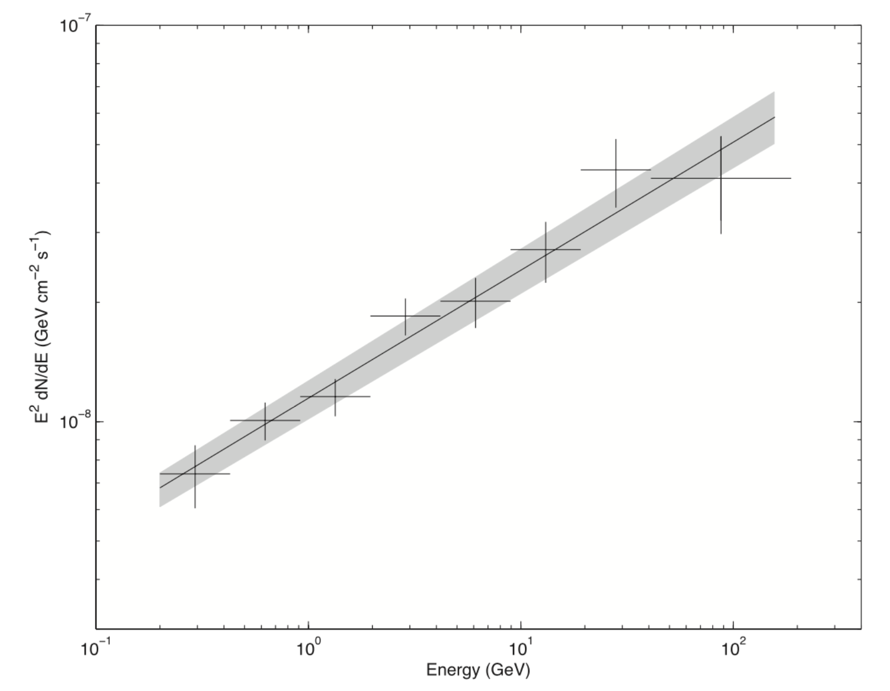

SED: Solutions to exercises
===========================

# Exercise 1: Plot the SED

You should get the following plot as a result—which can be found in figure `./Spectrum/SED_PG1553_PowerLaw2.png`:

1. Is the measured SED consistent with the power-law model as we chose? 

Yes, within the uncertainties.

2. Compare your result with Figure 1 of [Abdo et al. 2010 ApJ](http://adsabs.harvard.edu/abs/2010ApJ...708.1310A)—the result published by the LAT Collaboration using the first few months of observations of the telescope. Are the SEDs consistent with each other?

For comparison, here is the result published by the LAT Collaboration:

Besides the difference in energy units used—erg instead of GeV—the results are consistent with each other.

3. Do you notice anything funny going on with your fit? Remember that you fitted a power-law model. Pay attention to the highest energies measured.

Notice that the highest energy flux point at *E*=200 GeV deviates from a power-law—as well as your fit! What is going?

The redshift of this blazar is *z*=0.36. This turns out to be important. Because PG 1553 is relatively far away, gamma-rays will interact with lower energy photons in the [extragalactic background light (EBL)](https://www.universetoday.com/wp-content/uploads/hess_jet_quasar.jpg), pair-produce, and the resulting spectrum we will measure is not exactly a power-law but is attenuated at the high-energy end. This is the reason for the attenuation at energies >100 GeV. Fortunately, Enrico takes the EBL attenuation of the spectrum at high-energies into account.

If you are curious about the EBL and its imprint on gamma-ray spectra, you should have a look at this very cool [*Science* paper published by the LAT Collaboration](https://www.dropbox.com/s/u0slge2wqwg5kca/ackermann2012.pdf?dl=0) ([try this if the previous link is broken](http://science.sciencemag.org/content/338/6111/1190/tab-pdf)).

# Exercise 2: Counts spectrum

TBD
