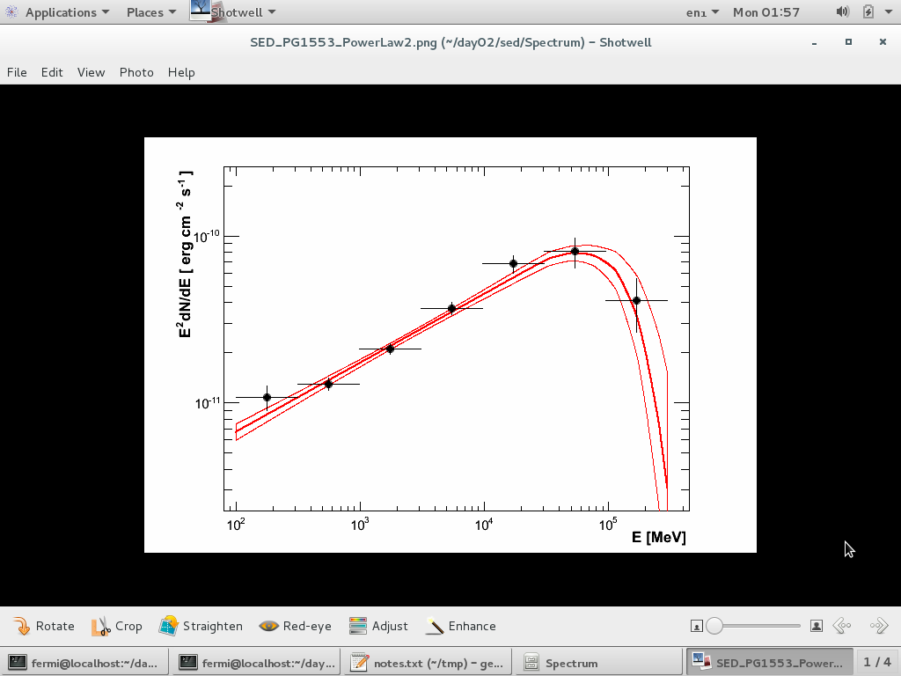

Generate SED
==============

In this hands-on activity, you will learn how to produce a sed for PG1553, reproducing old result from collaboration


# SED

```shell
cd ~/day02
mkdir sed
cd spectrum
cp pg1553.conf events.txt ~/day02/sed
```

edit conf file
out folder
[file]
	spacecraft = /home/fermi/day02/data/pg1553_SC00.fits
	event = events.txt
	xml = /home/fermi/day02/sed/PG1553_PowerLaw2_model.xml <=========
	tag = spectrum
change [Ebin]
	#Generates fits files or not?
	FitsGeneration = yes
	NumEnergyBins = 7
include screenshot

create XML:

    enrico_xml pg1553.conf 


    enrico_sed pg1553.conf

started 22:54
ended 01:47
dt = 2h50m

```
[fermi@localhost sed]$ enrico_plot_sed pg1553.conf 
[Message]: Save Ebin results in 
[Message]: Reading /home/fermi/day02/sed/Ebin7/PG1553_0.conf
[Message]: Energy bins results
Energy =  177.0
E**2. dN/dE =  1.08234529418e-11  +  1.8669187668e-12  -  1.8669187668e-12
[Message]: Reading /home/fermi/day02/sed/Ebin7/PG1553_1.conf
[Message]: Energy bins results
Energy =  556.0
E**2. dN/dE =  1.2966909576e-11  +  1.1563884279e-12  -  1.1563884279e-12
[Message]: Reading /home/fermi/day02/sed/Ebin7/PG1553_2.conf
[Message]: Energy bins results
Energy =  1745.0
E**2. dN/dE =  2.11215785539e-11  +  1.61963497302e-12  -  1.61963497302e-12
[Message]: Reading /home/fermi/day02/sed/Ebin7/PG1553_3.conf
[Message]: Energy bins results
Energy =  5477.0
E**2. dN/dE =  3.68410595707e-11  +  3.02001119251e-12  -  3.02001119251e-12
[Message]: Reading /home/fermi/day02/sed/Ebin7/PG1553_4.conf
[Message]: Energy bins results
Energy =  17190.0
E**2. dN/dE =  6.7988682993e-11  +  8.2282031554e-12  -  8.2282031554e-12
[Message]: Reading /home/fermi/day02/sed/Ebin7/PG1553_5.conf
[Message]: Energy bins results
Energy =  53954.0
E**2. dN/dE =  8.0641835618e-11  +  1.60158118073e-11  -  1.60158118073e-11
[Message]: Reading /home/fermi/day02/sed/Ebin7/PG1553_6.conf
[Message]: Energy bins results
Energy =  169338.0
E**2. dN/dE =  4.08989208649e-11  +  1.45252100068e-11  -  1.45252100068e-11
Info in <TCanvas::SaveSource>: C++ Macro file: /home/fermi/day02/sed/Spectrum/SED_PG1553_PowerLaw2.C has been generated
Info in <TCanvas::Print>: eps file /home/fermi/day02/sed/Spectrum/SED_PG1553_PowerLaw2.eps has been created
```

screenshot of SED: broken power-law



